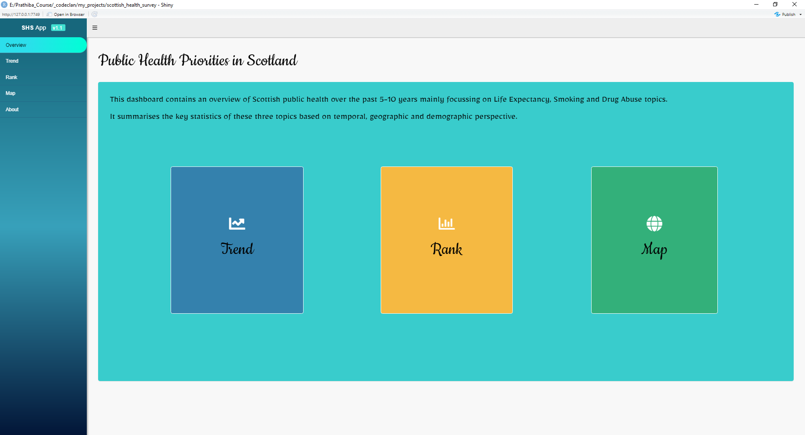
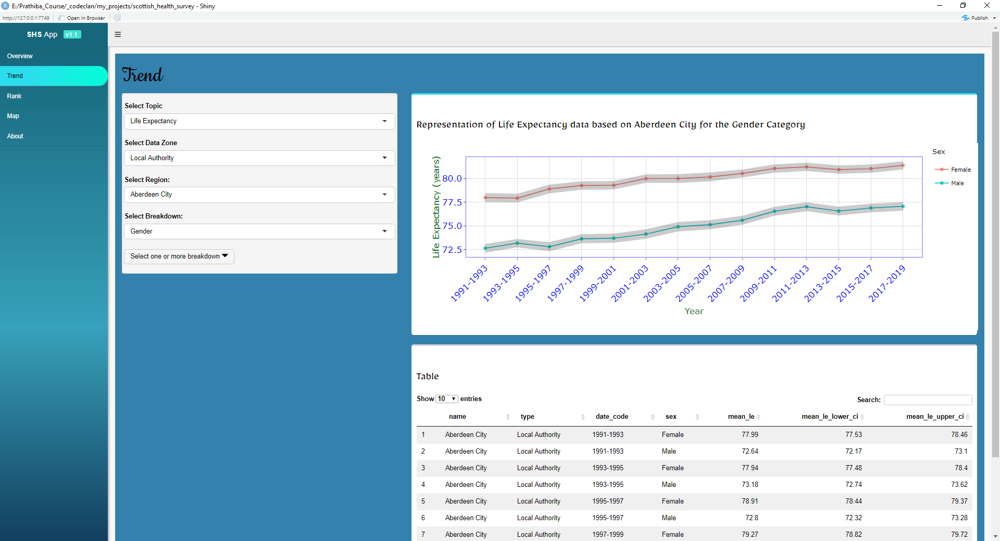
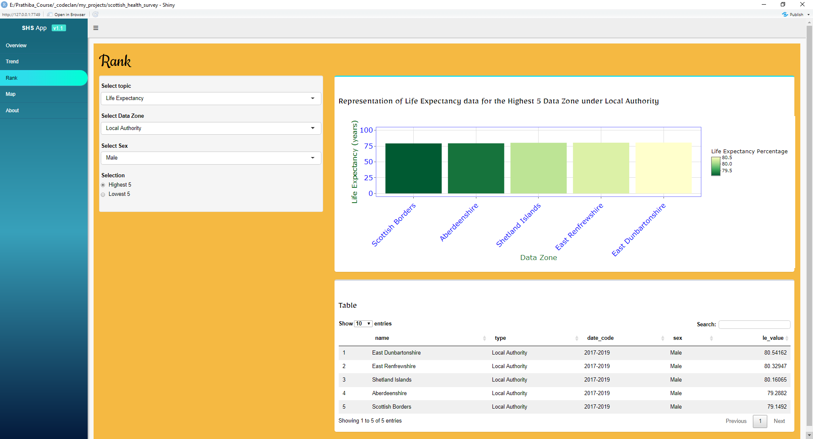
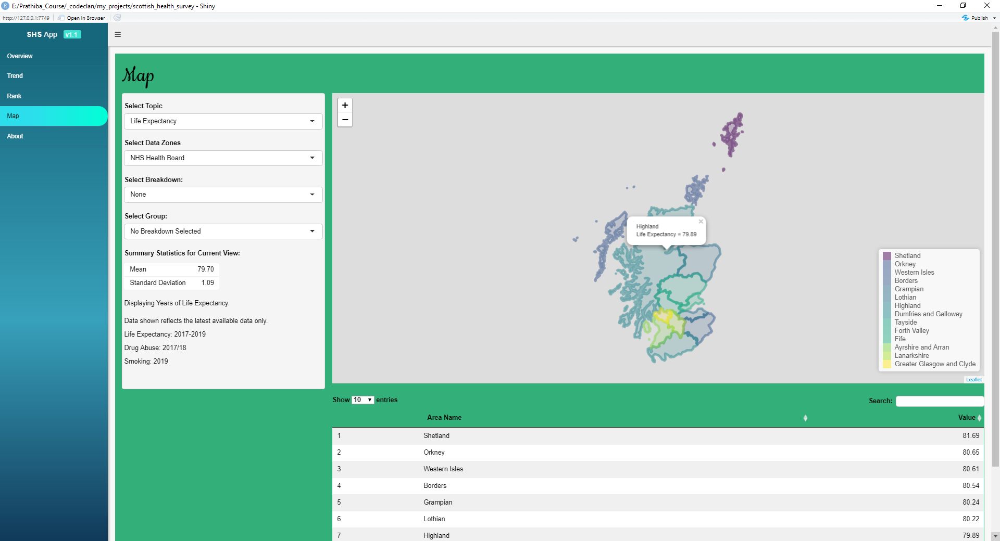
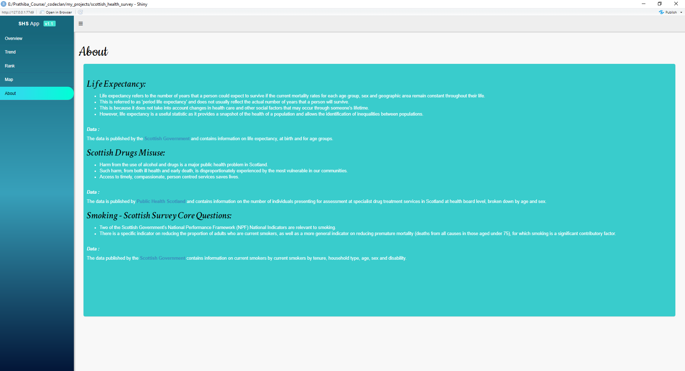

# Public Health Priorities in Scotland:

This project is done as a part of D10 Group Project. The original version of the project is available in the below link.

<https://github.com/prathibapradeep/codeclan_d10_dashboard_project>

Later, I have enhanced the GUI using Shiny Dashboard Themes. The functionality remains the same in both the versions.

## Domain knowledge and the business context

## **Background**

The background for the brief is based on [this official report of Scotland's public health priorities](https://www.gov.scot/publications/scotlands-public-health-priorities/) which was published in 2018. You can refer to that report if you want more context for the brief.

**Motivation**

It should be possible for everyone to be as healthy as they can be. We want to strengthen our efforts to ensure our health and care services are designed and delivered in the best possible way to meet population needs and improve health and wellbeing. A good understanding of public health in Scotland would be the foundation for the whole system, for public services, third sector, community organisations and others, to work better together to improve Scotland's health, and to empower people and communities. It would also be used as a starting point for new preventative approaches, and a new awareness around wellbeing, that will develop and strengthen in the coming years.

**Aims**

Our ultimate aim is to improve the health of the population and to reduce health inequalities. We want to make it easier for people to be healthy, and help local communities and public services make it possible for individuals to take positive decisions about their own health

## Business Questions:

-   The projects aims at creating a dashboard which contains the access to the following section:

    -   An overview of Scottish public health (Life Expectancy) over the past 5-10 years.

    -   A closer look at 2 specific health topics namely Smoking and Drug Use

-   The dashboard also presents the topics from 3 perspectives:

    1.  Temporal: How has this issue changed over time? (Is it getting better or worse?)

    2.  Geographic: How does this issue differ between areas in Scotland? (Where should efforts be focussed?)

    3.  Demographic: Who is most affected by this issue? (Who should be targeted with efforts?)

**Tools Used:** R, Plotly, Shiny, Shiny Dashboard

**Data Source:**

The data is downloaded from [statistics.gov.scot](https://statistics.gov.scot/home) in the form of CSVs.

Life Expectancy :

<https://statistics.gov.scot/resource?uri=http%3A%2F%2Fstatistics.gov.scot%2Fdata%2FLife-Expectancy>

Scottish Drug Misuse Data:

<https://www.opendata.nhs.scot/dataset/scottish-drug-misuse-database>

Smoking - Scottish Survey Core Questions :

<https://statistics.gov.scot/resource?uri=http%3A%2F%2Fstatistics.gov.scot%2Fdata%2Fsmoking-sscq>

There are no ethical considerations because the data is depersonalised, publicly available data from the Scottish Government .The datasets are covered by the Open Government License v3.0, which means we can use the Information that is available under this licence freely & flexibly, with only a few conditions.  Further details can be found at [Open Government Licence (nationalarchives.gov.uk)](http://www.nationalarchives.gov.uk/doc/open-government-licence/version/3/)

**Addendum:**

**Life expectancy:** Life expectancy refers to the number of years that a person could expect to survive if the current mortality rates for each age group, sex and geographic area remain constant throughout their life. This is referred to as 'period life expectancy' and does not usually reflect the actual number of years that a person will survive. This is because it does not take into account changes in health care and other social factors that may occur through someone's lifetime. However, life expectancy is a useful statistic as it provides a snapshot of the health of a population and allows the identification of inequalities between populations.

**Scottish Drugs Misuse:** Harm from the use of alcohol and drugs is a major public health problem in Scotland. Such harm, from both ill health and early death, is disproportionately experienced by the most vulnerable in our communities. Access to timely,compassionate, person centred services saves lives.

**Smoking - Scottish Survey Core Questions :** Two of the Scottish Government's National Performance Framework (NPF) National Indicators are relevant to smoking. There is a specific indicator on reducing the proportion of adults who are current smokers, as well as a more general indicator on reducing premature mortality (deaths from all causes in those aged under 75), for which smoking is a significant contributory factor.

Some of the snapshots from the dashboard.

